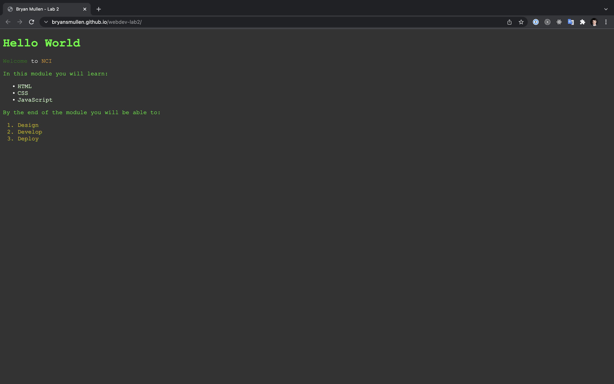
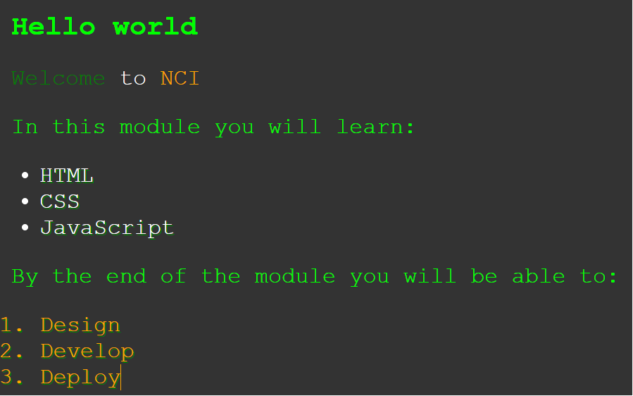

# Week 2 Lab



[View the live site here](https://bryansmullen.github.io/webdev-lab2/)

## Table Of Contents

1. [Running The Project](#running-the-project)
2. [Instructions](#instructions)
3. [Technologies Used](#technologies-used)
4. [Notes](#notes)

## Running the Project
1. Download the source code
2. If downloading as .zip file, extract to your machine
3. Ensure [Node and NPM](https://nodejs.org/en/) are installed on your system
4. Run `npm install` to install project dependencies
5. Run `npm start` to start a local development server

## Instructions
For this lab, please recreate the image below in HTML and CSS



Note:

Font family is 'Courier New', monospace;
List items have a green text shadow
Background color is #333

## Technologies Used
- HTML
- CSS
- Node/NPM

## Notes
- Colors sampled from image using Photoshop.

[BACK TO TOP](#week-2-lab)
